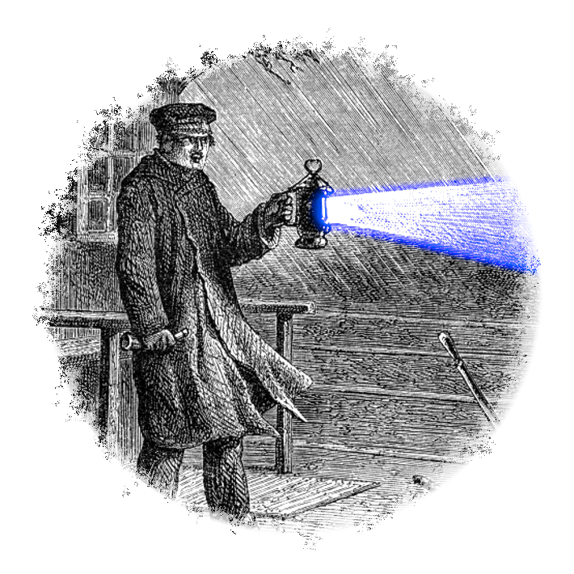

# Signalman

<div style="text-align: center">
    <mark style="display: block; width: 100%">🚨 <b>EXTREMELY WORK IN PROGRESS</b> 🚨</mark>
    
</div>

## Goal

Create a Rust interface for the Signal messaging app that can be used for account automation (bots, mailing lists, etc).

## Instructions

### Prequisites

A device running [NixOS](https://nixos.org/download/#nixos-iso) or a device running another Linux distro with [Nix](https://nixos.org/download/#nix-install-linux) installed. If your device is Windows, use [WSL](https://learn.microsoft.com/en-us/windows/wsl/install).

### Clone the repo and open it in VS Code

```bash
git clone https://github.com/jlgingrich/signalman
code signalman
```

This will set the default terminal for the workspace as a Nix Shell that contains the neccesary requirements (see [shell.nix](./shell.nix)). All further steps assume you're either running them in the VS Code default terminal, have opened the Nix shell in your other terminal, or otherwise have the requirements installed in your environment.

### Link to a Signal account as a secondary device

```bash
./scripts/signal-cli-init
```

This will print a QR code to the terminal output that can be scanned in the Signal app to link Signalman to your account.

### Run the signal-cli daemon

```bash
./scripts/signal-cli-run-daemon
```

This runs Signal-CLI, serving requests via [JSON-RPC](https://www.jsonrpc.org/specification) over a [Unix domain socket](https://emmanuelbosquet.com/2022/whatsaunixsocket/) service.

## References

### Rust Library Documentation

- [`anyhow`](https://docs.rs/anyhow/latest/anyhow/) for handling of non-domain errors.
  - Definitely not sure this is idiomatic, but I do like the additional context it can give returned errors.
- [`clap`](https://kbknapp.github.io/clap-rs/clap/index.html) for parsing command-line arguments.
- [`jsonrpc-types`](https://lib.rs/crates/jrpc-types) for JSON RPC types to serialize to and from.
  - The other JSON RPC libraries seem to be either application-specific, assume a TCP or HTTP transport, or are designed to create servers, not clients.
- [`serde`](https://docs.rs/serde_json/latest/serde_json/index.html) for JSON serialization.
- [`tokio`](https://docs.rs/tokio/latest/tokio/index.html) for the async runtime and IO.
  - [Channels](https://tokio.rs/tokio/tutorial/channels)
  - [Spawning](https://tokio.rs/tokio/tutorial/spawning)

### Signal

- [`signal-cli`'s JSON RPC daemon MAN page](https://github.com/AsamK/signal-cli/blob/master/man/signal-cli-jsonrpc.5.adoc)
- [`libsignal` source code](https://github.com/signalapp/libsignal)

## Stages

### Stage 1 : Rust to Signal CLI

Implement Signalman in Rust as a client app interacting with a Signal CLI daemon using a Unix domain socket.

### Stage 2: Total oxidification

Implement Signalman purely in Rust, using the [libsignal](https://github.com/signalapp/libsignal) Rust library directly.

## Progress

- [x] Able to read and deserialize JSONRPC notifications from a socket!
- [x] Able to write JSONRPC to the socket and receive the response
- [ ] Combine the two into one module, and create a really basic bot that replies to direct messages
